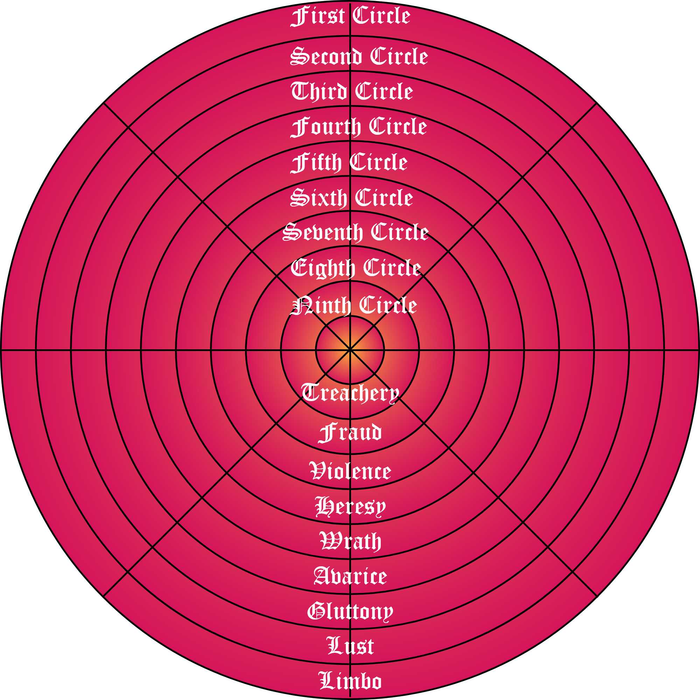
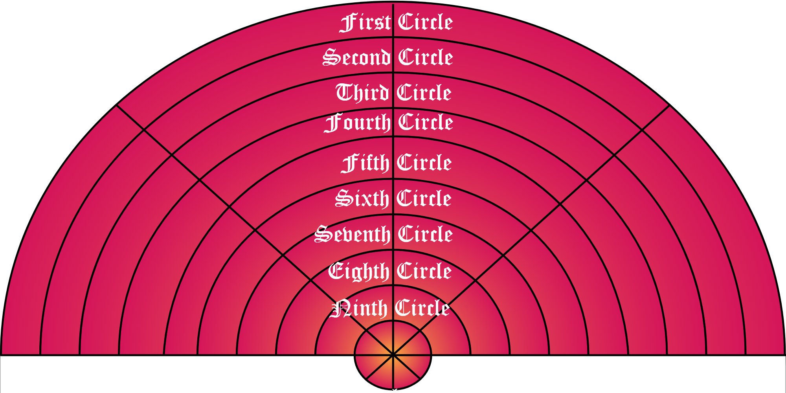

## Coursework 3

The game was decided to be based on Dante’s Inferno, the first part of the epic poem “Divine Comedy”. 

### Character cards
The characters will be based on the ones from the poem.

### Equipment cards
to be drawn not too frequently (perhaps at the beginning of a circle the players can decide which equipment to keep and which to discard for other equipment cards).

### The board
divided into 9 concentric circles which are further divided into 8 squares. The concept board was made in Adobe XD. It was based on a 1506 woodcut illustration by Antonio Manetti.

Circle concept:

Semi-circle concept:

### End game
to reach the end of the board
Another iteration of the game was made as 9x8 fields (9 concentric circles divided into 8 fields) seemed a bit excessive.
